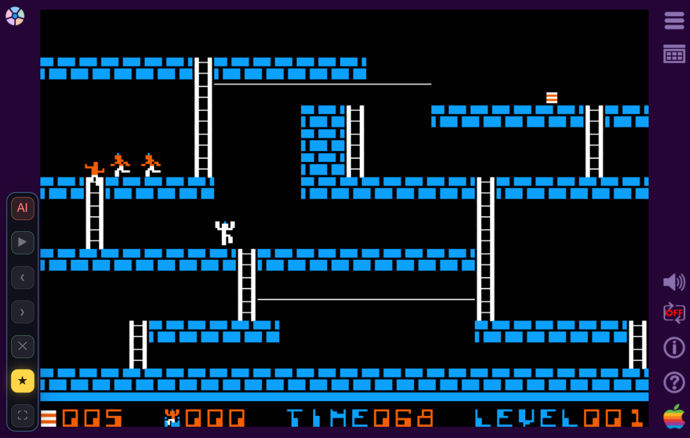
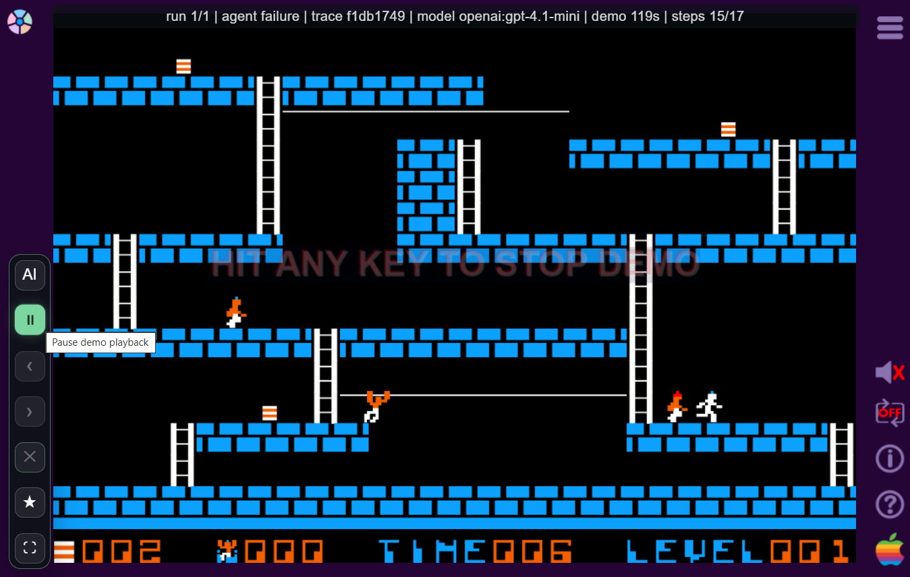

# Mini Runner

An LLM-based game agent plays [Lode Runner Total Recall](https://github.com/SimonHung/LodeRunner_TotalRecall), a HTML5 remake of the classic 1983 game **Lode Runner**.

### Technical Highlights

- **Game Engine:** Preserves the legacy CreateJS runtime with bundled levels and demo data under `public/game/*`.
- **Wrapper Frontend:** Vite app with an overlay UI for AI play, leveraging the legacy game as executor, recorder, renderer, and playback engine.
- **Python Backend:** Flask APIs for recordings, traces, agent calls, model profiles, and local JSON stores.
- **Candidate Agent:** Backend generates legal candidate actions, the LLM chooses one candidate id, and the backend translates it into legacy key/tick input.

### Project Structure

```
public/game/*             # Legacy Lode Runner runtime, physics, rendering, demo engine
src/*                     # Vite entrypoint, record & playback UI, game-loop, agent control
agent/*                   # Candidate generation, prompting, model calls, stall handling
app.py                    # Flask APIs for agent planning, tracing, and recordings
__data1/                  # Local JSON gameplay recordings, agent traces, and debug logs
```

The legacy codebase remains the source of truth for game physics, guard behavior, digging,
death, level completion and god mode.  All development happens in the wrapper and the backend.  Legacy files
only need to expose existing runtime state.

## Getting Started

**Prerequisites**

- Node.js
- Python 3.11+
- One supported LLM provider key

**Install dependencies**

```bash
git clone https://github.com/tombay3/mini-runner.git
cd mini-runner

python -m venv .venv
source .venv/bin/activate
pip install -r requirements.txt

npm install
```

**Configure a model**

Create `.env.local` with one model profile. Example using OpenAI:

```bash
AGENT_MODEL_PROFILE=openai
OPENAI_MODEL=gpt-4.1-mini
OPENAI_API_KEY=your_openai_api_key
```

**Start the backend**

```bash
npm run api
```

**Start the frontend**

```bash
npm run dev
```

Open `http://localhost:8283`.

Click `AI` to start or cancel an agent run. Use `Play`, `Prev`, `Next`, and
`Delete` to inspect stored recordings.

### Configure Model Profiles

Supported profiles:

- `openai`
- `minimax`
- `gemini`

You can override the active profile from the browser URL:

```text
http://localhost:8283/?profile=minimax
```

Model secrets live in `.env` or `.env.local`. Experiment control knobs live in
`public/agent-config.json`:

### Observability

The wrapper stores retained runs in `__data1/recordings.json` in legacy demo format.
Agent runs link to trace data in `__data1/agent-traces.json`.

Raw model I/O is written to `__data1/agent-debug.log` with local rotation.

### Sanity Tests

Run the lightweight backend/frontend sanity checks with:

```bash
npm test
```

These tests use direct helper and Flask test-client checks. They do not run the legacy game engine or call the LLM.

### Documentation

- [Codebase overview](docs/codebase.md): architecture, boot flow, and module map.
- [LLM agent](docs/llm-agent.md): candidate agent, snapshot flow, prompt, and stall handling.
- [Candidate design](docs/candidate-design.md): scoring, coverage, failure classification, and validation.
- [Backend spec](docs/backend-spec.md): Flask APIs, JSON stores, model profiles, and logging.
- [Recording and playback](docs/record-playback.md): wrapper rail, run selection, pause/step controls, and fullscreen behavior.
- [Sanity tests](docs/sanity-tests.md): quick backend/frontend regression checks.
- [Puzzle game](docs/puzzle-game.md): Lode Runner rules and puzzle-solving concepts.
- [Assessment](docs/assessment.md): high-level assessment of the legacy runtime.

## Screenshots



