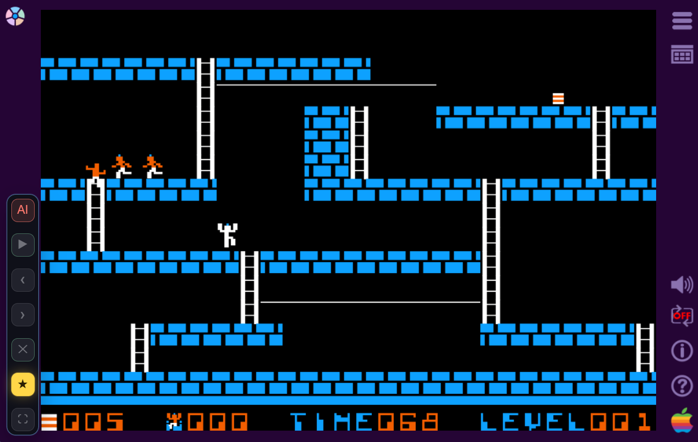
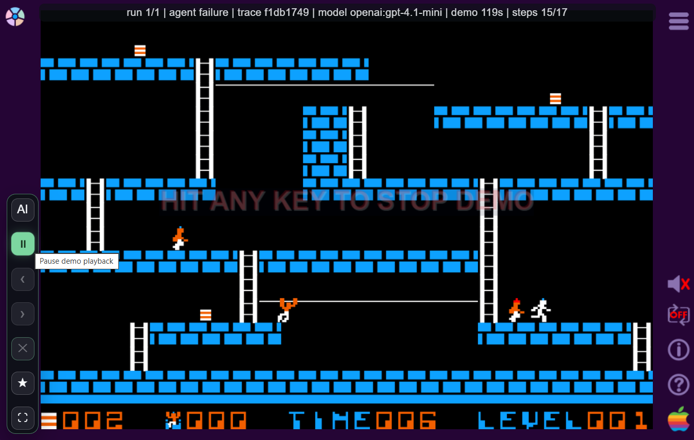

# Mini Runner

Mini Runner is an LLM-driven game agent for
[Lode Runner Total Recall](https://github.com/SimonHung/LodeRunner_TotalRecall), an HTML5
remake of the classic 1983 game **Lode Runner**. The project preserves the original game as
the authoritative executor while adding a constrained candidate agent, recording and replay
tools, an agent evaluator, and a trace dashboard for decision-level debugging.

## Architecture

- **Legacy game engine:** `public/game/*` owns physics, guard behavior, digging, death, level
  completion, rendering, demo recording, and demo playback.
- **Wrapper frontend:** `src/*` provides Vite bootstrapping, AI controls, stored-run playback,
  trace-aligned stepping, and the debug overlay.
- **Python backend:** `app.py` exposes Flask APIs for planning, recordings, traces, model
  profiles, and local JSON stores.
- **Candidate agent:** `agent/*` analyzes each snapshot, generates and scores legal actions,
  asks the LLM to choose a candidate ID, validates the choice, and translates it into legacy
  key/tick input.
- **Trace tooling:** `dash.py` and `loader.py` provide a read-only Streamlit and pandas view of
  retained runs, individual decisions, outcomes, loop events, and candidate selection.

```text
public/game/*             Legacy Lode Runner runtime, levels, rendering, and demos
src/*                     Vite wrapper, recording/playback UI, and browser agent loop
agent/*                   Analysis, candidate generation, prompting, validation, and traces
app.py                    Flask APIs for planning, tracing, and recordings
dash.py, loader.py        Streamlit agent-trace dashboard and pandas loader
scripts/*                 Sanity checks, evaluator, and offline trace analytics
__data1/                  Local recordings, traces, evaluation reports, and debug logs
```

New features normally belong in the wrapper, backend, agent modules, or tooling. The legacy
runtime remains the source of truth and should change only when legacy behavior itself must
change.

## Getting Started

### Prerequisites

- Node.js
- Python 3.11+
- An API key for one supported LLM provider

### Install dependencies

```bash
git clone https://github.com/tombay3/mini-runner.git
cd mini-runner

python -m venv .venv
source .venv/bin/activate
pip install -r requirements.txt

npm install
```

### Configure a model

Create `.env.local` with one model profile. For example:

```bash
AGENT_MODEL_PROFILE=openai
OPENAI_MODEL=gpt-5-nano
OPENAI_API_KEY=your_openai_api_key
```

Supported profiles are `openai`, `minimax`, and `gemini`. Secrets belong in `.env` or
`.env.local`; non-secret experiment controls belong in `public/agent-config.json`.

The browser URL can override the configured profile for runs started from that page:

```text
http://localhost:8283/?profile=minimax
```

### Run the application

Start the backend and frontend in separate terminals:

```bash
npm run api
```

```bash
npm run dev
```

Open [http://localhost:8283](http://localhost:8283). Click `AI` to start or cancel an agent
run. Use `Play`, `Prev`, `Next`, and `Delete` to inspect retained recordings.

## Trace Dashboard

The trace dashboard is the primary agent-trace stepping and debugging tool. It lets you
inspect retained recording and the decisions within them, connecting each run action to
the state that produced it, the candidates the model could see, the requested choice, backend
validation, the executed action, and the observed outcome. Existing stores can be inspected
without running the game frontend or backend.

Start it in another terminal with the Python environment activated:

```bash
streamlit run dash.py --server.port 8601
```

Open [http://localhost:8601](http://localhost:8601). It reads `__data1` by default; use
`AGENT_DATA_DIR` or the sidebar path to choose another folder. Press **Reload data** after the
JSON changes. See [Trace dashboard](docs/trace-dashboard.md) for its views, fields, and retention.

## Observability And Local Data

The wrapper stores replayable demos in `__data1/recordings.json`. Agent recordings link to
decision traces in `__data1/agent-traces.json` through `traceId`. See
[Trace API and store](docs/backend-spec.md#trace-api-and-store) for stored data and retention.

Set `AGENT_DEBUG_LOG=1` to write the latest 10 raw model I/O turns to
`__data1/agent-debug.log`. Raw prompts and model responses are excluded from normal traces.

For aggregate offline analysis, `scripts/trace-analytics.ipynb` reads recordings, runs, steps,
candidates, outcomes, loop events, and fallbacks without changing them.

## Testing And Evaluation

### Sanity checks

Run the lightweight backend and frontend checks with:

```bash
npm test
```

These checks use direct helpers and the Flask test client. They do not run the legacy game or call
an LLM. See [Sanity tests](docs/sanity-tests.md) for coverage and when to run them.

### Agent evaluator

Run repeatable normal-mode attempts against the real browser game and configured model:

```bash
npm run evaluate -- --runs 10 --target 5
```

`--target N` stops early after `N` successful runs; the evaluator performs at most the requested
`--runs` attempts.

Use `npm run evaluate -- --smoke` to verify the browser, wrapper, backend, and legacy runtime
without calling the model. See [Agent evaluator](docs/evaluator.md) for profiles, reports,
normal-mode enforcement, and exit statuses.

## Documentation

- [Codebase overview](docs/codebase.md): architecture, boot flow, and module map.
- [LLM agent](docs/llm-agent.md): snapshot flow, prompt, candidate selection, and loop filtering.
- [Candidate design](docs/candidate-design.md): scoring, action coverage, failure classification,
  and validation.
- [Backend spec](docs/backend-spec.md): Flask APIs, JSON stores, model profiles, and logging.
- [Trace dashboard](docs/trace-dashboard.md): run overview, trace stepping debugger, and candidate
  analysis.
- [Recording and playback](docs/record-playback.md): wrapper rail, run selection, pause/step
  controls, and fullscreen behavior.
- [Sanity tests](docs/sanity-tests.md): backend and frontend regression coverage.
- [Agent evaluator](docs/evaluator.md): repeatable real-runtime normal-mode trials and reports.
- [Puzzle game](docs/puzzle-game.md): Lode Runner rules and puzzle-solving concepts.
- [Legacy runtime](docs/legacy-runtime.md): original CreateJS architecture and features.

## Screenshots




## Credits

The game runtime is based on
[SimonHung/LodeRunner_TotalRecall](https://github.com/SimonHung/LodeRunner_TotalRecall).
