# Agent Evaluator

## Purpose

`npm run evaluate` runs repeatable Classic level 1 attempts in a real headless Chrome or
Chromium browser. It starts the existing Vite wrapper and Flask backend when needed, then
uses the wrapper's normal browser agent loop and the authoritative legacy runtime for every
snapshot, tick, collision, death, completion, demo, and trace.

Startup waits for backend health, wrapper installation, and completion of the legacy
CreateJS asset queue before the first attempt begins.

The evaluator always disables god mode before an attempt and rejects a report when the
recorded demo or terminal trace does not prove normal-mode execution.

## Evaluation Loop



## Usage

```sh
# Ten fresh runs with the configured default model profile
npm run evaluate

# Run up to 10 MiniMax attempts, stopping after 5 successes
npm run evaluate -- --profile minimax --runs 10 --target 5

# Verify server, browser, wrapper, backend, and normal-mode startup without calling an LLM
npm run evaluate -- --smoke

# Preserve full attempt summaries outside the retained trace window
npm run evaluate -- --runs 20 --output __data1/evaluation-20.json
```

`--target N` is the number of successful runs required for an early stop. The evaluator
will run at most `--runs` attempts; if the target is reached sooner, it stops and reports
the completed attempts. Without it, all requested runs execute. Threshold and runs are positive
integers, with a maximum of 100.

Chrome is discovered from common system paths. Set `EVAL_BROWSER_EXECUTABLE` or pass
`--browser <path>` when it is installed elsewhere. Use `--headful` to watch the evaluation.

Evaluation calls the configured model once per backend decision and can consume substantial
time and provider quota. `--smoke` is the no-model infrastructure check.

## Report

Each attempt records:

- success or failure and failure reason;
- recording and trace IDs;
- model metadata, legacy demo time, and backend decision count;
- terminal runner, guard, and gold state;
- candidate-kind counts, generic fallback count, confirmed loops, and suppressed-candidate count;
- whether both the demo and terminal snapshot prove god mode was off.
- whether every trace step stayed in Classic `1:1` with a monotonic tick timeline.

Failures before the first planner decision are recorded as zero-step traces with the actual
backend/provider error and requested model metadata.

The summary includes successes, failures, success rate, optional success-target result, and any
normal-mode violations. Exit status is:

- `0`: evaluation ran and met the optional target;
- `1`: infrastructure or execution error;
- `2`: the requested success target was not reached;
- `3`: at least one attempt was not proven to be normal mode.
- `4`: a run changed context or reset its tick timeline, indicating legacy-runtime contamination.

Stores retain every recording protected by a manual recording pin, its linked trace when
present, and the newest 10 other entries. Use `--output` when a larger campaign needs a durable
aggregate report.
